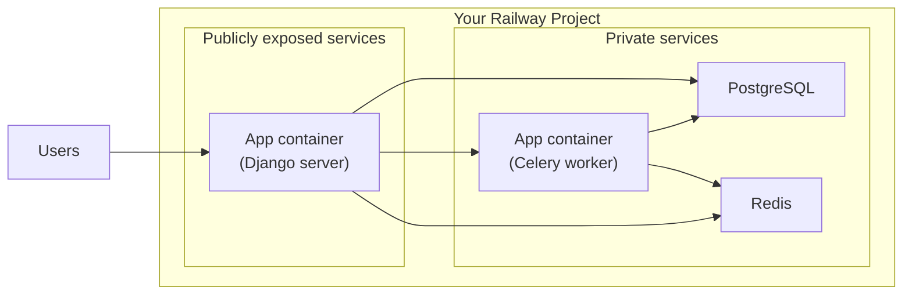

# `railway_django_stack`

<!-- BUTTON HERE -->

## Resources

This template deploys:

- 1 service running Django
- 1 service running Celery (same as container #1 but with different startup command)
- 1 service running Redis
- 1 service running Postgres

You can test the setup locally with docker compose:

```bash
git clone https://github.com/Antvirf/railway_django_stack
cd railway_django_stack
docker-compose up
```

## Service diagram



## Django project setup

This is a barebones Django-project with the following additions/updates:

- Configures a PostgreSQL database
- Configures a Redis cache
- Configures Celery, and installs the following add-on apps:
    - [`django-celery-beat`](https://github.com/celery/django-celery-beat) for periodic task management
    - [`django-celery-results`](https://github.com/celery/django-celery-results) for viewing results of Celery tasks in Django Admin
- Uses [`python-decouple`](https://github.com/HBNetwork/python-decouple) to manage settings via environment varialbes
- Installs and runs with [`gunicorn`](https://github.com/benoitc/gunicorn)

## Variable configurations

| Variable | Description | Used by |
| -------- | ----------- | ------- |
`POSTGRES_HOST` | This should be the private URL of the Postgres service | Django, Celery
`POSTGRES_DB` | Sets the Postgres default database name | Django, Celery, Postgres
`POSTGRES_USER` | Sets the Postgres username | Django, Celery, Postgres
`POSTGRES_PASSWORD` | Sets the Postgres user's password | Django, Celery, Postgres
`REDIS_URL` | Configures the private URl of the Redis service | Django, Celery |
