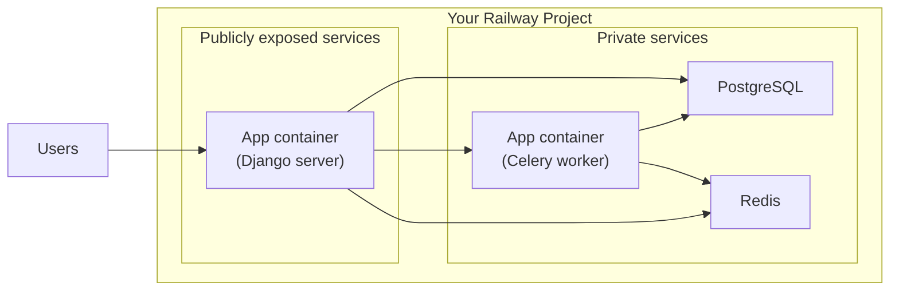

# `railway_django_stack`

[](https://railway.app/template/NBR_V3?referralCode=6rOei9)

Full Django/Postgres stack with Celery tasks and Redis as cache/queue.

## Overview

Deploy a "complete" Django setup - DB, caching and background tasks with Celery are all set up and ready to go.

Check out the full readme and brief on GitHub: https://github.com/Antvirf/railway_django_stack

## Deploying the template

1. In the deployment screen, you will need to configure a `DJANGO_SECRET_KEY`. You can use the below snippet to do that or otherwise generate your own.
    <details>
    <summary>Snippet to create secret</summary>

    **This assumes your default python installation has Django installed.**

    ```bash
    python -c 'from django.core.management.utils import get_random_secret_key; print(get_random_secret_key())'
    ```

    </details>
1. Once the containers have been deployed, please take the following steps to delete public proxy addresses, as you will not need to access the private services directly:
    - Go to the **Postgres** service > Settings > Networking, delete the proxy
    - Go to the **Redis** service > Settings > Networking, delete the proxy

## Resources

This template deploys:

- 1 service running Django
- 1 service running Celery (same as container #1 but with different startup command)
- 1 service running Redis
- 1 service running Postgres

You can test the setup locally with docker compose:

```bash
git clone https://github.com/Antvirf/railway_django_stack
cd railway_django_stack
docker-compose up
```

## Service diagram

> **Warning**
> Please check the instructions above on deploying the template. By default, Railway creates publicly available proxies for your Postgres and Redis services - make sure to delete them. Should you ever need direct access, creating the proxies is just a few clicks.



## Django project setup

This is a barebones Django-project with the following additions/updates:

- Configures a PostgreSQL database
- Configures a Redis cache
- Configures Celery, and installs the following add-on apps:
  - [`django-celery-beat`](https://github.com/celery/django-celery-beat) for periodic task management
  - [`django-celery-results`](https://github.com/celery/django-celery-results) for viewing results of Celery tasks in Django Admin
- Uses [`python-decouple`](https://github.com/HBNetwork/python-decouple) to manage settings via environment varialbes
- Uses [`whitenoise`](https://github.com/evansd/whitenoise) to make serving static assets easy
- Installs and runs with [`gunicorn`](https://github.com/benoitc/gunicorn)
